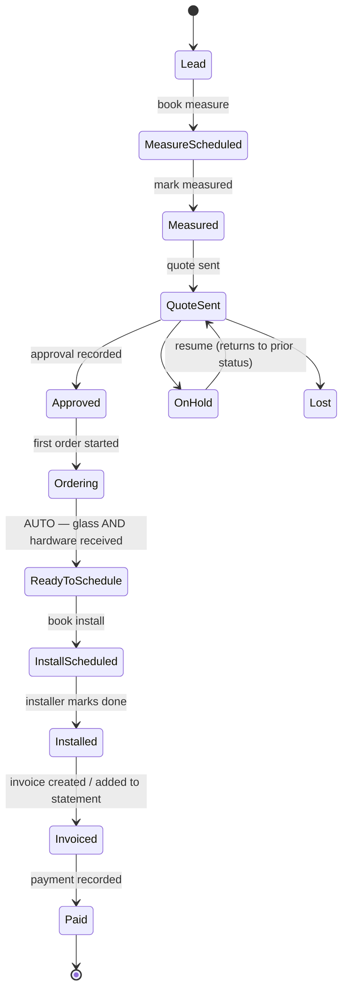

# Glaze Board — Product Spec

What to build: the business, the workflow, the data, the screens. (Why → `3-decisions.md`. How/when → `4-build-ledger.md`.)

---

# PART 1 — The Business

Small custom glass shop, Sacramento / Northern California. Frameless shower enclosures sold with installation, plus mirrors, wine rooms, partitions, railings. **We are the subcontractor** — our customers are general contractors and remodelers (B2B); occasionally homeowners direct. The UI always calls them **Customers**, never "subs."

**The twist:** on contractor jobs the homeowner approves the design while the contractor pays. Years later, service calls come from homeowners — often with nothing but an address.

**Two supply chains per job:** glass made to order by Glassfab (PO → acknowledgment PDF → packing slip → delivery); hardware from CRL (cart → order → will-call or delivery). **Jobs sit idle because nobody notices both halves arrived.** Fixing that is the system's core purpose.

**Team:** 6 users — 2 office (owner + PM/estimator), 4 field (two forming a standing team). Designs/quotes are made in CRL Showers Online (no API); books are kept in QuickBooks Online.

**Portals:** `/m` management (built now) · `/f` field (next ledger) · `/c` contractor (much later). Field roles can never open `/m`; office roles may open `/f` for oversight.

---

# PART 2 — Workflow (the state machine)

Every transition works as a tap in the app **and** as a message to the assistant (later phase); both log identically. The app is fully operable by hand — AI accelerates, never gates.

## 2.1 Project pipeline

*On Hold and Lost are reachable from any status; the diagram shows one representative each.*

| From → To | Trigger | Actor | Required | Side effects | Undo |
|---|---|---|---|---|---|
| — → Lead | Quick-create (≤3 inputs) | Office | Customer + address | Feed entry; on Pipeline | Delete via feed |
| Lead → Measure Scheduled | Book visit | Office | Date/time | Visit + calendar invites; Today | Cancel visit |
| → Measured | "Mark measured" tap | Office/Field | none | Optional skippable prompt: photos, dimensions | Back one |
| → Quote Sent | Tap, or drop the quote PDF | Office | Recipient chip | Quote record; 7-day aging timer starts | Back one |
| → Approved | Tap ("approved, Mike texted") | Office | none (note optional) | Approval record (who/how/when); unlocks ordering actions; optional deposit prompt | Remove approval |
| → Ordering | Auto when either track starts | System | none | Feed entry | Follows track |
| **→ Ready to Schedule** | **AUTO: glass AND hardware received** | System | none | **Push notification; scheduling message drafted (human sends); jumps to top of Today** | Reopening a track reverts |
| → Install Scheduled | Book install | Office | Date/time + assignee(s) | Visit + invites; appears on field Today | Cancel visit |
| → Installed | Installer taps Done | Field | none | Photos, then **homeowner sign-off** (name + signature; skip requires a logged reason — normal for new construction); care message drafted 48h later | Back one |
| → Invoiced | "Invoice this job" or included in a statement | Office | none | Invoice record + QuickBooks id | Void note |
| → Paid | Payment sync or manual | System/Office | none | Paid date/method; drops off unpaid balances | Back with note |
| any → On Hold | Tap | Office | Reason (1 field; follow-up +7d) | Timers pause; resurfaces on Today | Resume → prior status |
| any → Lost | Tap | Office | Reason (1 field) | If glass ordered: optional loss note | Reopen |

**Out-of-order reality:** any forward status may be set even if earlier ones were skipped (hardware ordered on a verbal OK). Nothing is blocked; the jump is noted in the feed.

## 2.2 Glass order track — `Not ordered → PO Sent → Acknowledged → Ready/Shipped → Received` · plus **`Not Needed`** (one tap, for jobs with no glass order)

- **Prepare order:** generates our **PO number** (the matching key), a copyable block (sizes, glass type, notes), **and a ready-made email link** — subject already reading `PO GF-2026-0142 — 42 Oak St`, body already containing the block. One click opens the owner's mail program fully filled in; he presses send. The system still sends nothing. Then one tap: "PO sent." Starts a 2-business-day acknowledgment timer.
- **Acknowledged:** the email agent parses Glassfab's acknowledgment PDF, matched by PO number — stores their order number, line items, price (→ margin), **promised date**, attaches the PDF.
- **Ready/Shipped → Received:** later emails or a one-tap manual "Glass received." **Idempotent:** a late email for an already-received order only attaches the document.
- **Revised acknowledgment:** same PO → update promised date, feed notes the change ("7/29 → 8/05"), immediate flag if it conflicts with a booked install.
- **Remake:** on a received order, creates a linked child order (own PO, own track) without regressing the project; project shows an "awaiting remake" chip.
- **Exceptions:** no acknowledgment 2 business days after PO sent; promised date passed without shipping.

## 2.3 Hardware order track — `Not started → In Cart → Ordered → Received` · plus **`Not Needed`** (one tap — mirrors and railings often need no hardware)

In Cart is a deliberate parking state. Ordered records the CRL order number and **will-call vs delivery**. Will-call surfaces as a pickup quick-action on Today. **Partially received** carries a one-line missing note and does *not* count as received.

## 2.4 The gate (DEC-28 — word this exactly)

> **Glass is satisfied** when the project has at least one glass order and every one is Received, **or** the glass track is marked Not Needed.
> **Hardware is satisfied** when it is Received **or** marked Not Needed.
> **The gate fires** only when both are satisfied **and at least one track actually reached Received.**

Why each clause exists: mirror, partition and railing jobs often need no CRL hardware at all — without *Not Needed* those jobs would wait forever for something that was never coming, which is the exact failure this system exists to prevent. And "all glass orders received" is technically true of a project with *zero* orders, so the last clause stops an empty job leaping to Ready to Schedule.

On firing: `gate_fired_at` is stamped (the bell rings once per opening), the project advances to **Ready to Schedule**, all office users are notified, and the scheduling message is drafted for one-tap sending. If either track reopens, `gate_fired_at` clears and the project drops back to Ordering with the reason in the feed.

## 2.5 Tickets — `New → Scheduled → Resolved` (+ Closed/Won't fix)

Created from: the public form, service@ email, manual (<15 s), or one tap + one line from a project. Carries contact info, address, issue, urgency (leak = urgent), source. **Matched to the original project by address first**, then phone, then name; unmatched gets a "no matching project" flag and stays fully serviceable. Warranty (≤1 yr since install) vs billable is proposed by AI, confirmed by a human. **Dedupe:** same phone or address within 48 h merges, second source noted.

---

# PART 3 — Data Model

Postgres (Neon). Every table has `id` (uuid), `created_at`, `updated_at`. \* = required at creation; everything else fills progressively.

**Conventions that apply everywhere:**
- **Money is whole cents in integer columns** (a $1,250.00 price is `125000`). Never a decimal type in code; formatting happens only at display (DEC-30).
- **Every timestamp carries a time zone**, and each company has one (`companies.timezone`). "Two business days" and "7 a.m." are computed in company time (DEC-30).
- Addresses stored raw + normalized: `address_norm` (number + street), `address_unit`, `zip` — **address is a first-class matching key**.
- Every business table gets row-level security **enabled and forced**, in the migration that creates it (DEC-21).

## Tenancy (first migration)

- **`companies`** — the tenant: `name*`, `status`, `branding` (logo, colors, quote footer), `timezone`, `public_form_slug` (the address of that company's public service form).
- **Every other table carries `company_id*`.** Isolation is enforced by **Row-Level Security in Postgres**: each request runs in a database context stamped with the logged-in user's company and role, set by the single connection layer `src/lib/db-core.ts`. A bug in a screen cannot cross companies.
- **The login library owns the users table.** Better Auth's `user` table *is* our users table, extended with our fields — there is never a second one. Its four tables (`user`, `session`, `account`, `verification`) sit **outside** company filtering and are reached only through `readAuth()` in `db-core`: a session must be read before the company is known, so filtering it by company would make login impossible (DEC-23). Every *business* table is filtered.
- Sessions carry `company_id` + `role`. Field users get a second layer: only rows where they're an assignee.
- The app connects with a limited database account that owns nothing; migrations use the owner account — a table's owner would otherwise bypass its own security policies (DEC-21).
- Every index is composite starting with `company_id`. `users.platform_admin` is the software owner's cross-company override; every use is logged.

## Tables

**users** — the login library's `user` table extended with: `company_id*`, `role*` (admin | manager | field), `platform_admin`, `active`, `phone`. Never a separate table (DEC-23).
**teams** — `name*`, `member_ids*`. Assigning a team expands to members; individuals always pickable.
**accounts** (UI: Customers) — `name*`, `phone`, `email`, `billing_type` (per_job | monthly), `default_terms`, `qb_customer_id`, `notes`. Built-in "Direct" for homeowner jobs.
**contacts** — `name*`, `phone`, `email`, `account_id` (nullable). Indexed on phone + name.
**project_contacts** — `project_id*`, `contact_id*`, `role*` (gc_contact | homeowner | tenant | property_manager | other), `is_primary`. Zero-to-many; new construction may have only the GC.
**projects** — `title*` (auto "{Customer} — {short address}", editable), `account_id*`, **`site_address*` — always required, always its own field, never inherited from the customer's office address**, `address_norm`, `address_unit`, `zip`, `lat`, `lng`, `status*`, `job_type` (shower | mirror | wine_room | partition | railing | other), `source`, `access_lockbox_code`, `access_notes` (both shown to field), `hold_reason`, `hold_until`, `lost_reason`, `gate_fired_at`, `quote_id`, `margin_price`, `margin_glass_cost`, `margin_hardware_cost`, per-status timestamps. Indexes: status, address_norm, account_id, full-text title+address.
**quotes** — `project_id*`, `number`, `status` (draft | sent | viewed | approved), `line_items`, `amount`, `terms`, `parties_snapshot` (our block + customer + homeowner as printed), `pdf_document_id`, `share_token` (read-only view, view-tracked), `sent_to`, `sent_at`.
**approvals** — `project_id*`, `kind*` (combined now; design|cost reserved), `approved_by_contact_id`, `method` (tap | assistant | text | email | verbal), `note`, `attachment_document_id`, `at*`.
**glass_orders** — `project_id*`, `status*` (incl. **`not_needed`**), `supplier`, `po_number` (auto, unique), `supplier_order_number`, `line_items`, `price`, `promised_date`, `received_at`, `parent_order_id` (⇒ remake), `remake_reason`.
**hardware_orders** — `project_id*`, `status*` (incl. **`not_needed`**), `supplier`, `order_number`, `fulfillment` (will_call | delivery), `items`, `cost`, `partial`, `missing_note`, `received_at`.
**visits** — the **only** record of who is on a job (DEC-29). `type*` (measure | install | service — drives the color token), `project_id`/`ticket_id`, `starts_at*`, `duration`, `assignees*`, `team_id`, `outcome_note`, `photos`, `calendar_uid`.
**tickets** — `status*`, `contact_name`, `contact_phone`, `contact_email`, `address`, `address_norm`, `address_unit`, `zip`, `issue*`, `urgency`, `source*`, `classification` + `classification_confirmed`, `project_id` (nullable + `no_match`), `transcript_url`, `recording_url`.
**documents** — `file*`, `type*` (quote | acknowledgment | packing_slip | order_confirmation | invoice | photo | **signoff** | other), `mime`, `size`, links to project/order/ticket, `extracted` (json), `source*`, `email_message_id` (dedupe). Sign-off documents carry `signer_name`, `signed_at`, signature image — or the logged skip reason.
**invoices** — `scope*` (project | statement | deposit), `project_id`, `account_id*`, `project_ids`, `amount*`, `qb_invoice_id`, `sent_at`, `paid_at`, `paid_method`, `change_orders`.
**activity_events** — append-only feed: `project_id`/`ticket_id`, `actor*` (user | office_agent | email_agent | voice_agent | assistant | system), `verb*`, `target`, `details` (incl. evidence), `undone_by_event_id`.
**messages** — customer comms threaded per project/ticket: `direction`, `channel` (email | sms), `body`, `status`, `sent_by`.
**command_log** — assistant utterances: `user_id*`, `channel*`, `chat_id`, `raw_text*`, `interpreted`, `outcome`, `activity_event_id`.
**ai_runs** — every LLM call: `purpose`, `input_ref`, `output`, `model`, `cost`, `confidence`.

**Required at creation:** Project = customer + site address. Ticket = issue + (phone or address). Visit = date/time + assignee. Everything else progressive.

---

# PART 4 — Screens

Benchmark: a paper notebook, not enterprise software. Calm, dense-but-clean, readable in sunlight. Common actions ≤2 taps.

**Management navigation — two wings + Settings.** Operations: Today · Pipeline · Dispatch · Service · Review Queue. Customers & Sales: Customers · Quotes · Billing. Mobile: bottom tabs for the five Operations items, Customers wing behind "More".

**Search & quick-actions bar** (top of every management screen): instant search across projects, contacts, addresses, order numbers. Typed commands run the same interpreter as the messaging assistant with the same confirm cards. Never required — every button exists regardless.

**Today view** (home): urgent tickets → today's visits (color-coded, address, map link) → Ready-to-Schedule → will-call pickups ready → Review Queue → exceptions (overdue acks, missed promised dates, aging quotes). One card, one action each. Empty state: "Nothing needs you. Enjoy it."

**Pipeline board:** **five lanes**, not one per status (eleven columns cannot be read on a phone, and the card already shows its exact status) — **Sales** (Lead, Measure Scheduled, Measured, Quote Sent) · **Ordering** (Approved, Ordering) · **Ready & Scheduled** (Ready to Schedule, Install Scheduled) · **Installed** · **Billing** (Invoiced, Paid); On Hold/Lost collapsed. Cards: name, customer, exact status, days-in-status (amber >7), glass + hardware chips (tap = advance menu). Drag between lanes moves to that lane's first status; backward confirms. Mobile: lane-filtered list.

**Dispatch:** week/day lanes per person (team assignments show on both members' lanes; drag to move) plus a **map** (OpenStreetMap now, Google-ready behind the same adapter) with a pin per visit, colored by task type. Tap a pin → visit card → assign / reschedule / open. Booking sheet: date/time + person(s) or Team + duration (default 2h). Mobile: day list with a map toggle.

**Project screen — one project, one screen, no tabs-within-tabs:** header (title, status pill, site address with map link) · contacts block (role chips, tap-to-call/text, add-person with role picker) · access row (lockbox code + notes) · glass and hardware track chips (tap = the only advance menu) · **exactly one next-action button**, computed from status · activity feed newest-first with documents inline and AI entries marked with evidence links · details drawer (quote, approvals, deposits, invoices, margin = price − glass − hardware).

**Quick-create (sacred):** customer picker with instant "add new" from typed text · site address · optional note. **≤30 seconds, three inputs, one-handed.** Nothing else will ever live on this sheet.

**Quote Builder:** our company block (branding) + customer + homeowner · lines auto-filled from a dropped CRL quote PDF or entered by hand · terms · total · generate PDF · copy **share link** (read-only, view-tracked) · send. The contractor-side quote link is a visible **disabled placeholder** — awaiting definition (open item D5).

**Review Queue:** email/PDF on the left; the AI's best guess, confidence, and top-3 alternative projects on the right; Confirm / Reassign / Ignore. Corrections logged as training signal. Badge on Today.

**Service board & Ticket screen:** columns New/Scheduled/Resolved; cards show name-or-address, issue one-liner, urgency flame, warranty-vs-billable chip, "no matching project" badge. Ticket screen: contact block (call/text), address + map + matched project (or manual link search), issue + photos, urgency toggle, classification confirm, scheduling, feed.

**Public service form** at `/service/[company-slug]` (no login): **Phone\*** · **Address\*** · issue + optional photos · name (optional) · email (optional) → "Got it — we'll call you back today." An anonymous visitor has no session, so the company comes from the address in the link; bot protection is Turnstile plus a Cloudflare rate-limiting rule.

**Customer page:** header (contacts, billing type) · open projects · **completed & unbilled with "Generate invoice"** (billing door #1) · unpaid balance · notes.
**Billing page** (door #2, same flow): pick customer → review their completed unbilled jobs (toggle any off) → one tap Create & send. **Never automatic.**

**Settings (readable in ten seconds):** **users & roles — create a user, send an invite, deactivate, name Team 1's members (admin only)** · Team · mailbox connections · QuickBooks connect · messenger binding · notification toggles · per-action AI autonomy toggles (all off) · timer numbers.

**Field portal** (next ledger): their assignments only, color-coded, address + one-tap navigate; job screen with drawings, photos, notes, **access info**; complete flow = photos → optional punch-list → **homeowner name + finger-drawn signature**, skip requires a reason.

**Global rules:** chips over forms (any transition prompt ≤1 field) · optimistic UI · installable PWA · push for gate flips, exceptions, urgent tickets, 7 a.m. digest · **fixed colors app-wide: measure `#2563EB` · install `#16A34A` · service `#EA580C` · urgent = red ring** — same color means the same thing on a card, a lane, and a map pin.
